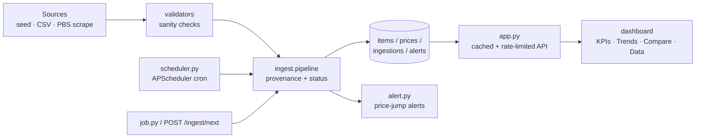

# Pakistan Inflation / Price Tracker (Z5)

A small full-stack service that **ingests price data, stores a time-series,
charts trends over time with date filters, alerts on price jumps, and explains
what the data shows about inflation** — for a representative basket of
everyday goods in Pakistan.

Built on the Z2 backend skills (backend + data pipeline) with a **Python /
Flask + SQLite + Chart.js** stack. SQLite is used instead of Postgres so the
project has **zero external-server dependency** and the pipeline runs anywhere
reproducibly.

## Features / Definition of Done

| Requirement | Status |
|---|---|
| **Data pipeline runs reproducibly** | ✅ `seed.py` regenerates the same DB from `model.py`; `test_pipeline.py` verifies determinism |
| **Charts render with filters** | ✅ Chart.js dashboard with date-range presets, category + item filters, and a "Basket cost index" view |
| **The explainer is clear and correct** | ✅ `explainer.md` (and `/static/explainer.html`) — stats computed from the data |

Bonus: ✅ price-jump alerts (week-over-week threshold) · ✅ basket comparison ·
✅ item search · ✅ one-click CSV export · ✅ "Update data" ingest button ·
✅ live KPI cards (incl. annualized + year-over-year inflation) ·
✅ Compare bar-chart view · ✅ Data table view.

## Production readiness

**Data provenance & approval workflow** — every price point stores *where it
came from* and *how it was collected*:

| Column | Meaning |
|---|---|
| `source` | which source produced it (`seed`, `csv`, `weekly-job`, `pbs-web`…) |
| `method` | how it was fetched/parsed (`generator`, `csv-import`, `html/csv scrape`) |
| `collected_at` | UTC timestamp of collection |
| `status` | `approved` / `pending` / `rejected` |
| `review_note` | why it was held (e.g. "suspicious +25% week-over-week") |

`validators.classify()` decides the status: normal swings are auto-approved,
implausible ones are held **pending** and are *excluded from every public
endpoint* until a human approves or rejects them:

```
POST /ingest/next {"auto_approve": false}   # stage everything for review
GET  /api/admin/pending                     # review queue
POST /api/admin/approve {"ids":[..]} | {"all":true}
POST /api/admin/reject  {"ids":[..]} | {"all":true}
```

Every batch is also written to the `ingestions` audit table
(source, method, ran_at, counts) — so the index is fully reproducible and
auditable.

**Architecture**



**Caching, rate limiting, health & logging**

- `flask-caching` caches the read APIs (SimpleCache by default; set
  `CACHE_TYPE=RedisCache` + `REDIS_URL` to move to Redis). Cached responses
  are invalidated on every ingest/approval, so data is never stale.
- `flask-limiter` rate-limits reads (`RATE_LIMIT_DEFAULT`) and writes
  (`RATE_LIMIT_WRITE`).
- `GET /healthz` reports status, item count, latest approved date, pending
  queue size and uptime (200 / 503) for uptime monitoring.
- `log.py` emits JSON-lines logs (`LOG_LEVEL`, `JSON_LINES=0` for text).

**Scheduling**

```bash
python scheduler.py --once   # one ingest run (CI-friendly)
python scheduler.py          # long-running APScheduler (Sat 06:00 UTC)
```

In production run the scheduler as its own process/container (or use cron /
GitHub Actions / Celery beat) rather than inside the web process.

**Configuration (env vars)**

| Var | Default | Purpose |
|---|---|---|
| `PORT` | `5010` | web port |
| `CACHE_TYPE` / `CACHE_TTL` | `SimpleCache` / `300` | cache backend + TTL |
| `REDIS_URL` | `redis://localhost:6379/0` | used when `CACHE_TYPE=RedisCache` / Redis rate-limit storage |
| `RATE_LIMIT_DEFAULT` / `RATE_LIMIT_WRITE` | `300/min` / `60/min` | rate limits (Flask-Limiter syntax) |
| `RATE_LIMIT_STORAGE` | `memory://` | limiter storage (`memory://` or a Redis URL; use Redis with multiple workers) |
| `FORCE_HTTPS` | `0` | emit HSTS when TLS terminates upstream |
| `ADMIN_TOKEN` | *(unset)* | when set, `/api/admin/*` + `POST /ingest/next` require it (`X-Admin-Token` or `Bearer`); when unset those routes accept **loopback callers only** |
| `ADMIN_ALLOW_LOCAL` | `1` | set `0` to close admin routes even on localhost (e.g. nginx on the same host) |
| `LOG_LEVEL` / `JSON_LINES` | `INFO` / `1` | logging |

See `.env.example` for the full contract (incl. `INGEST_CRON_*`, `INGEST_INTERVAL_SECONDS`).

## Project layout

```
model.py          # item definitions + deterministic price generator (data source)
db.py             # storage layer: items, prices (+ provenance/status), ingestions, alerts
validators.py     # sanity checks -> approved / pending / rejected
ingest/           # sources (SeedSource, CSVSource, PBSWebSource) + pipeline
seed.py           # ingest step: rebuild an approved baseline (reproducible)
job.py            # weekly ingest job (validated pipeline + alerts), idempotent
scheduler.py      # APScheduler cron wrapper for the ingest job
alert.py          # price-jump alert logic (approved data only)
analyze.py        # headline stats (used by the explainer)
app.py            # Flask API: cached, rate-limited, /healthz, admin approval
log.py            # structured (JSON) logging
tests/            # pytest suite (fixtures, validators, pipeline, app/caching)
test_web.py       # boots the real server and checks every route
shot.py           # headless-Chrome render QA (screenshot + DOM assertions)
static/           # dashboard (Chart.js) + standalone explainer page
explainer.md      # the written economics explainer
pyproject.toml    # pytest / coverage / ruff / black / mypy config
```

## Staged roadmap (honest status)

Done and verified in this repo: provenance + approval workflow, validated
ingestion pipeline (CSV + generator sources), APScheduler scheduling, caching
with invalidation, rate limiting, `/healthz`, structured logging, pytest +
coverage, CI config, lint/format/type config, pre-commit.

Needs infrastructure not present here (documented, designed for, not yet run):
- **Postgres + Alembic migrations** — the DDL is Postgres-compatible; provision
  a Postgres, point `DATABASE_URL` at it, and introduce Alembic as the schema
  manager (current code still self-migrates via `init_db()` for SQLite).
- **Redis cache backend** — set `CACHE_TYPE=RedisCache` (+ `REDIS_URL`).
- **Live PBS scraping** — `ingest/sources.py:PBSWebSource` is the scaffold;
  wire an endpoint with the publisher's permission + network access.
- **Forecasting / STL / change-point detection** and **Docker + deploy** are
  the next polish steps on this foundation.

## Quick start

```bash
# 1. create a virtualenv and install Flask
python -m venv .venv
.venv/Scripts/python -m pip install -r requirements.txt     # Windows
# .venv/bin/python ...                                       # macOS/Linux

# 2. ingest data into SQLite (reproducible)
.venv/Scripts/python seed.py

# 3. (optional) simulate the "job that adds new data over time"
.venv/Scripts/python job.py --date 2026-09-12

# 4. run the server
.venv/Scripts/python app.py
# open http://127.0.0.1:5010
```

Run the checks:

```bash
.venv/Scripts/python -m pytest            # unit + integration tests
.venv/Scripts/python test_web.py          # live server checks (seed first)
.venv/Scripts/python analyze.py           # headline numbers
```

## How the data pipeline works

1. **Ingest** — `seed.py` reads the deterministic generator in `model.py`
   (11 items, weekly prices Jan 2023 → mid/late 2026) and writes
   `data/inflation.db`. Deterministic means re-seeding reproduces the same data.
2. **Store** — tables `items`, `prices` (item_id, date, price) and `alerts`.
3. **Job** — `job.py` appends the *next* weekly observation for every item and
   recomputes alerts. It is idempotent, so you can schedule it via cron /
   Task Scheduler / GitHub Actions:
   - Windows Task Scheduler: `python job.py`
   - cron: `0 6 * * 6 cd <repo> && .venv/bin/python job.py`
4. **Serve** — `app.py` exposes the API and the dashboard.

## API

| Route | Description |
|---|---|
| `GET /` | dashboard |
| `GET /api/items` | list tracked items |
| `GET /api/series?start=&end=&items=` | filtered time-series (ISO dates, CSV item ids) |
| `GET /api/index?start=&end=&items=` | equal-weight basket cost index (100 at range start) |
| `GET /api/metrics?start=&end=&items=` | summary stats for the window (drives the KPI cards) |
| `GET /api/inflation?start=&end=&items=` | annualised / weekly / year-over-year inflation |
| `GET /api/pivot?start=&end=&items=` | item × date matrix + basket index (Trends/Compare/Data) |
| `GET /api/series.csv?...` | download the current view as CSV |
| `GET /api/alerts?threshold=5&start=&end=` | price-jump alerts within the window |
| 🔒 `POST /ingest/next` | run the ingest job on demand (see the "Update data" button) |

🔒 = admin/write route. Protected by `core/auth.py`: requires `ADMIN_TOKEN`
(via `X-Admin-Token: <token>` or `Authorization: Bearer <token>`) when a token
is configured, and accepts **loopback callers only** when it is not.

```bash
# authenticated ingest (ADMIN_TOKEN set on the server)
curl -X POST https://<your-service>.onrender.com/ingest/next \
     -H "X-Admin-Token: $ADMIN_TOKEN" -H "Content-Type: application/json" \
     -d '{"auto_approve": true}'
```

## Dashboard

A full responsive dashboard (Flask + SQLite + Chart.js, Inter font):

- **Hero header** with a live "latest price" badge and an **Update data** ingest button.
- **KPI cards** — Basket cost change, **Annualised inflation**, **Year-over-year**,
  and **price-jump count** for the selected window.
- **Three views (tabs):**
  - **Trends** — line charts of each item's prices, or the whole-basket cost index.
  - **Compare** — horizontal bar chart of % change since the range start (who rose most).
  - **Data** — sortable table (start / latest / change per item).
- **Controls** — date presets (3M / 6M / 1Y / All) + custom range, alert threshold, CSV export.
- **Basket filters** — category chips, item checklist, and a live **search box**.
- **Alerts panel** — items that jumped ≥ the threshold week-on-week, largest jump highlighted.
- Loading spinners, friendly empty states, toasts, custom scrollbars, mobile layout.

## Checking it works

```bash
python seed.py                       # rebuild an approved baseline
pytest --cov --cov-fail-under=80     # unit + integration tests with coverage
python test_web.py                   # boots the real server, hits every route
python scheduler.py --once           # one real ingestion run
python shot.py                       # (optional) headless-Chrome render QA
```

After a deploy (or against any running instance):

```bash
python smoke_prod.py https://<your-service>.onrender.com   # real-host smoke test
```

CI (`.github/workflows/ci.yml`) runs lint → format check → type check →
seed → tests with coverage → live web checks on every push.

## Deploying

Because everything is a single `app.py` with a flat-file DB:

- **Render (recommended, one click)** — a Blueprint is included
  (`render.yaml`): push to GitHub, then in Render choose **New → Blueprint**
  and accept the plan. It provisions one free web service that:
  - builds with `pip install -r requirements.txt`,
  - **seeds the database at boot** via `boot.py` (free tiers have an ephemeral
    filesystem — this guarantees `/healthz` is ready on the first boot and
    keeps existing data on any later persistent disk),
  - serves on the injected `$PORT` with `/healthz` as the health check.
- **Railway / any PaaS** — build `pip install -r requirements.txt`, start
  `python boot.py && python app.py`.
- **Any VPS / free host** — copy the folder, install requirements, run
  `python app.py` behind a reverse proxy (e.g. Caddy/nginx).

**Weekly data refresh:** the bundled generator can produce future weeks, so
`python job.py` keeps appending points. On Render, cron is a separate service
(see the commented block in `render.yaml`); on the free tier prefer an external
scheduler (GitHub Actions cron) — and set `ADMIN_TOKEN` first, since the admin
routes are closed to the public internet by default.

**Docker:** not included in this repository yet (the `Makefile`'s
`docker-up`/`docker-down` targets assume a `docker-compose.yml` you provide).
Render deploys directly from `requirements.txt` via the Python runtime, so no
container is needed for the hosted setup.

**After deploying, verify it's actually live** — one command checks the whole
production contract (health, readiness, public reads, admin protection, security
headers, SSE, rate-limit headers):

```bash
python smoke_prod.py https://<your-service>.onrender.com
# with the admin token, to also verify authenticated writes:
ADMIN_TOKEN=<your token> python smoke_prod.py https://<your-service>.onrender.com
# read-only variant (skips the one mutating check):
python smoke_prod.py https://<your-service>.onrender.com --no-write
# exits 0 with "DEPLOYMENT VERIFIED", or 1 listing every failure
```

Then click **Update data** on the dashboard: with `ADMIN_TOKEN` set it prompts
once for the token and ingests the next week; without one it correctly reports
that writes are blocked (rather than a phantom success).

## Known limitations

- **The series is a representative model, not official PBS data** — it is
  *modelled on* Pakistan's real CPI experience (high inflation in 2023 easing
  to disinflation by 2025–26, volatile fresh produce, high energy pass-through).
  Swap `model.py` for a permitted public API/CSV to go live; the pipeline,
  storage and charts don't change. Only collect data where permitted.
- **Admin endpoints are protected by default** — `/api/admin/*` and
  `POST /ingest/next` change the dataset, so they are closed to the public
  internet: without `ADMIN_TOKEN` only strict-loopback callers (local dev, the
  test client) may write, and everyone else gets `403`. Set `ADMIN_TOKEN` to a
  long random secret to allow authenticated writes from a deployed dashboard
  (`X-Admin-Token: <secret>` or `Authorization: Bearer <secret>`); the
  dashboard prompts for it on the first `401` and remembers it for the tab.
  See `core/auth.py` and `tests/test_auth.py`.
- **SQLite is single-writer** — fine for this workload, but move to Postgres
  (`DATABASE_URL`, schema is compatible) for multi-worker production.
- **Rate-limit counters are per-process with `memory://`** — run multiple web
  workers only after switching `RATE_LIMIT_STORAGE` to Redis.
- **Free-tier hosts have ephemeral disks** — re-seed on boot or attach a
  persistent disk, and schedule `job.py` externally (see *Deploying*).
- **No forecasting / STL / change-point detection yet** — see the roadmap.

## Data caveat

The series is a *representative manual dataset* modelled on Pakistan's real CPI
experience (high inflation in 2023 easing to disinflation by 2025–26, volatile
fresh produce, high energy pass-through) — it is *not* the official PBS series.
Swap `model.py` for a permitted public API/CSV to go live; the pipeline,
storage and charts don't change. Only collect data where permitted.